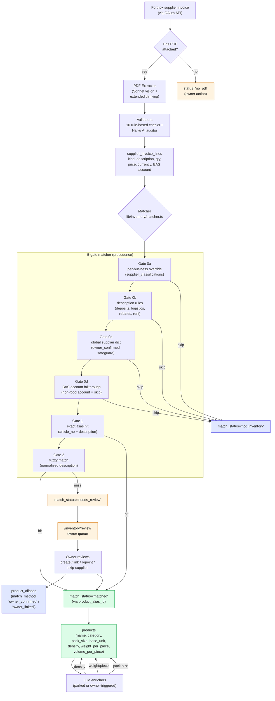
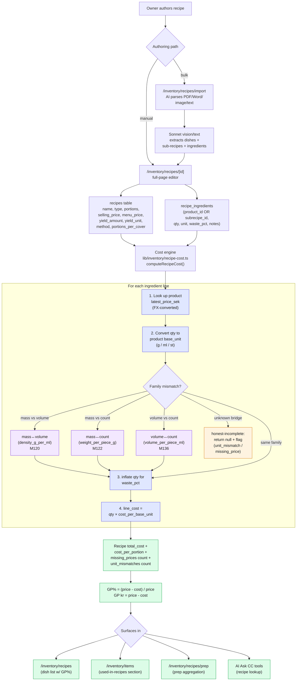
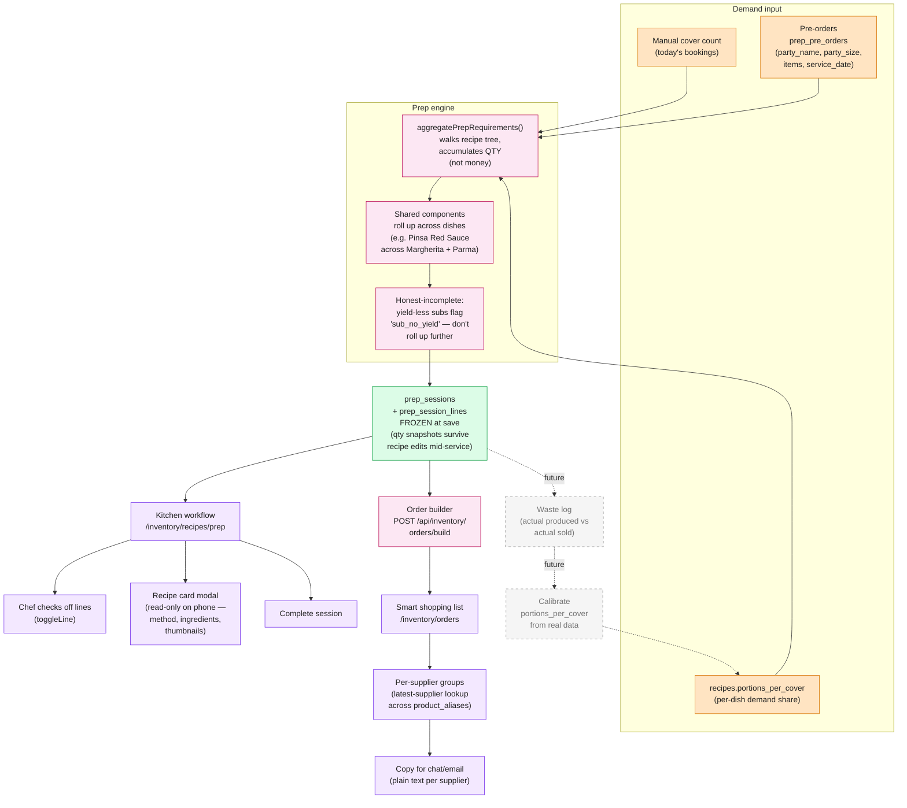
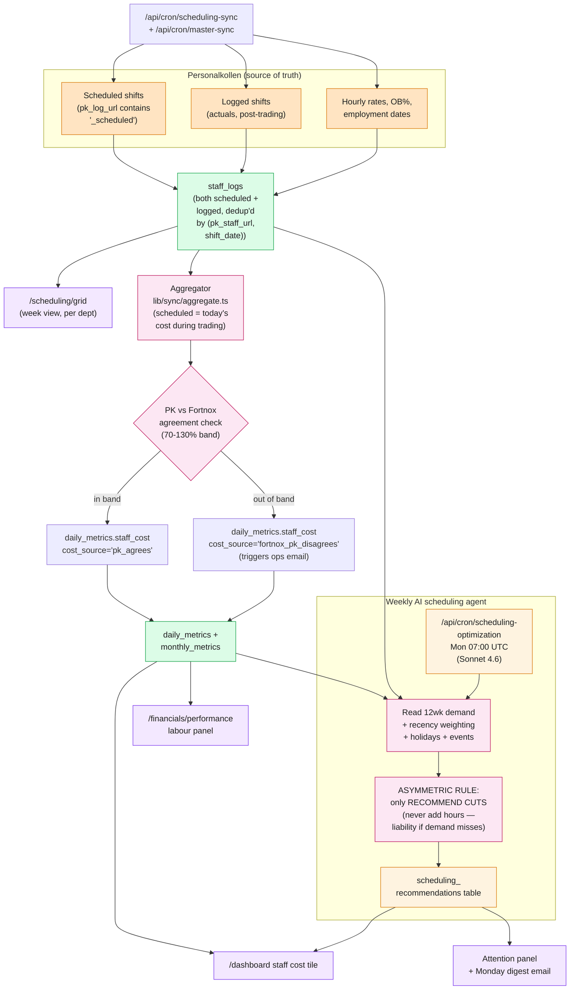
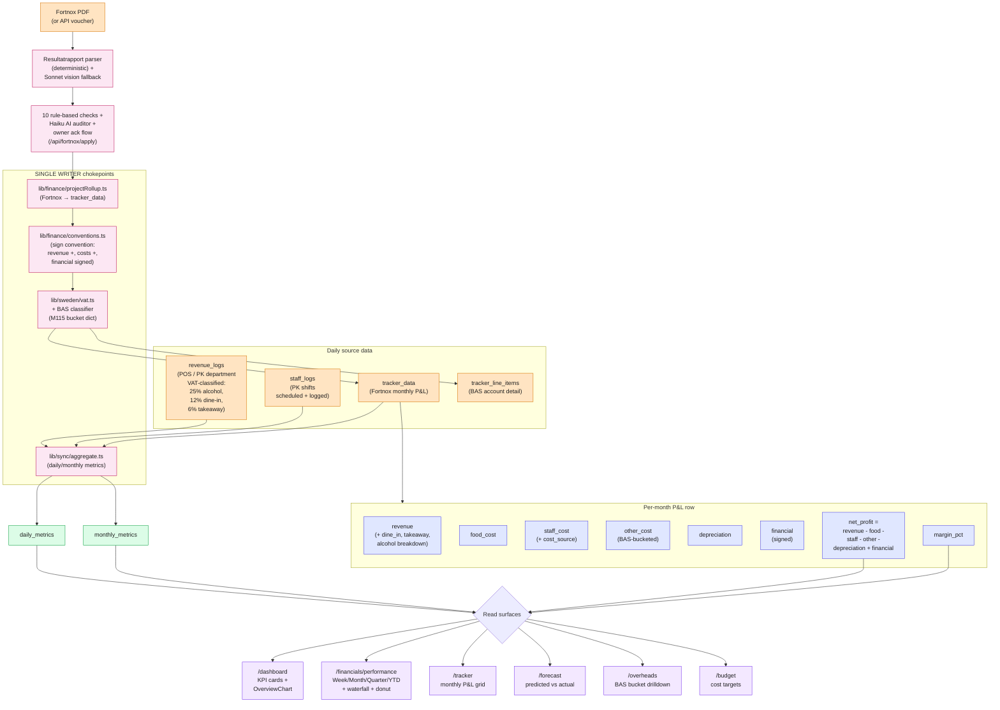
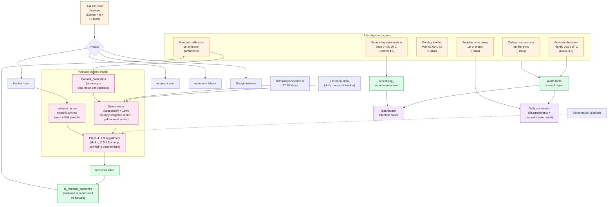
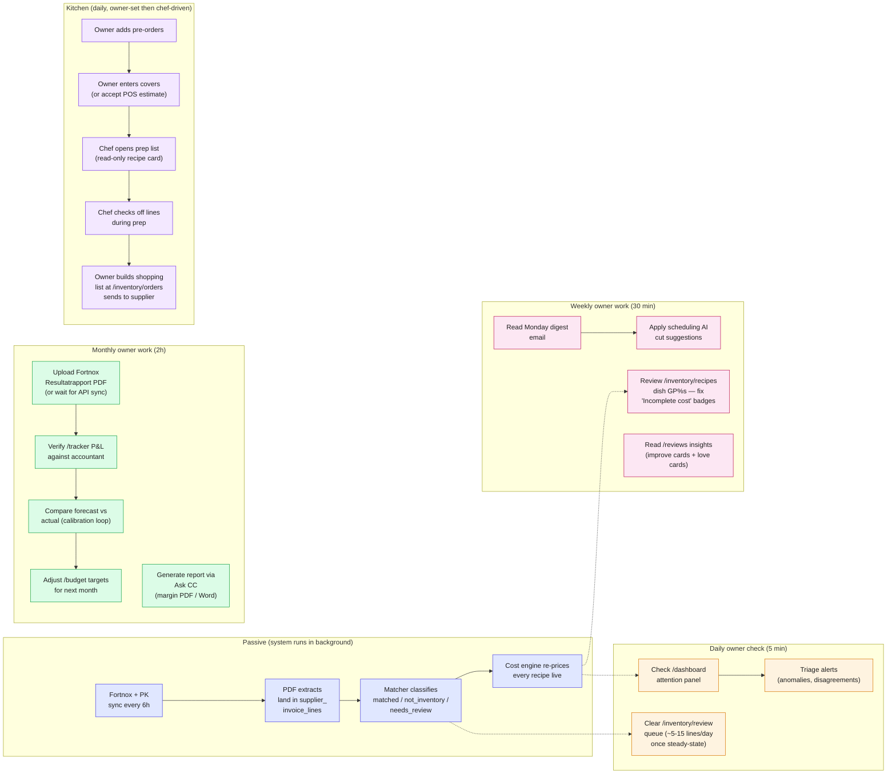

# CommandCenter — End-to-End Pipeline Flowchart

> Hand this whole file to Claude.ai / ChatGPT / Figma-AI and ask for a visual mockup.
> Every diagram below is in Mermaid syntax — most AI tools render Mermaid natively.
> If your target tool doesn't, the section text above each diagram is plain English
> the AI can re-draw from.

The pipeline has five pillars:

1. **Ingress** — Fortnox, Personalkollen, POS, Google, FX (data flowing IN)
2. **Inventory + Food Cost** — invoices → products → recipes → live cost (the engine)
3. **Prep + Orders + Waste** — kitchen-facing operational layer
4. **Scheduling + Labour** — PK shifts + AI suggestions → labour cost
5. **Aggregation + Monthly Outcomes** — single-writer rollup → dashboards, P&L, AI insights

A sixth layer wraps everything: **AI agents** (anomaly, forecast, briefing, scheduling)
and **feedback loops** (forecast outcomes, alias corrections, owner reviews) that
re-train the system over time.

---

## 1. Master pipeline — everything at a glance

```mermaid
flowchart TB
    subgraph INGRESS["INGRESS — external data sources"]
        FORTNOX["Fortnox<br/>(OAuth)<br/>vouchers, supplier<br/>invoices, BAS, P&amp;L"]
        PK["Personalkollen<br/>(OAuth)<br/>shifts, costs,<br/>departments"]
        POS["POS via PK<br/>(Onslip / Ancon /<br/>Swess)<br/>revenue, covers,<br/>VAT split"]
        GOOGLE["Google Places<br/>reviews (themes)"]
        ECB["ECB<br/>daily FX rates"]
        TM["Ticketmaster<br/>(parked)"]
    end

    subgraph SYNC["SYNC LAYER — cron-driven"]
        MASTER["/api/cron/master-sync<br/>daily 05:00 UTC"]
        FNSYNC["/api/cron/fortnox-sync<br/>+ pdf-backfill<br/>every 6h"]
        SCHEDSYNC["/api/cron/scheduling-sync<br/>PK shifts"]
        FX["/api/cron/fx-rates-update<br/>daily"]
        REVSYNC["/api/cron/reviews-sync"]
    end

    subgraph STORE["STORAGE — Supabase Postgres"]
        TBL_VOUCH["fortnox vouchers<br/>+ pdf cache"]
        TBL_LINES["supplier_invoice_lines<br/>(extracted from PDF)"]
        TBL_PROD["products<br/>+ product_aliases"]
        TBL_REC["recipes<br/>+ recipe_ingredients<br/>+ sub-recipes"]
        TBL_STAFF["staff_logs<br/>(PK shifts)"]
        TBL_REV["revenue_logs<br/>(POS, VAT-classified)"]
        TBL_TRACK["tracker_data<br/>+ tracker_line_items<br/>(monthly P&amp;L)"]
        TBL_PREP["prep_sessions<br/>+ pre_orders"]
        TBL_DAILY["daily_metrics +<br/>monthly_metrics"]
    end

    subgraph PROC["PROCESSING — the engines"]
        EXTRACT["PDF extractor<br/>(Sonnet vision)"]
        MATCHER["Matcher<br/>lib/inventory/matcher.ts<br/>5 gates"]
        COST["Cost engine<br/>lib/inventory/recipe-cost.ts<br/>w/ FX + density bridges"]
        AGGREG["Aggregator<br/>lib/sync/aggregate.ts<br/>(single writer)"]
        ROLLUP["Finance rollup<br/>lib/finance/projectRollup.ts<br/>VAT classifier"]
        WORKER["AI agents<br/>(anomaly, forecast,<br/>briefing, scheduling)"]
    end

    subgraph SURFACE["READ SURFACES — what the owner sees"]
        DASH["/dashboard<br/>KPI cards + attention"]
        PERF["/financials/performance<br/>revenue, food, labour,<br/>overheads, net-margin"]
        TRACKER["/tracker<br/>monthly P&amp;L"]
        FORECAST["/forecast<br/>predicted vs actual"]
        ITEMS["/inventory/items<br/>articles + cost"]
        RECIPES["/inventory/recipes<br/>dishes + GP%"]
        PREP["/inventory/recipes/prep<br/>kitchen prep list"]
        ORDERS["/inventory/orders<br/>supplier shopping list"]
        SCHED["/scheduling/grid"]
        OVER["/overheads<br/>BAS-bucketed cost"]
        ASKCC["/ai — Ask CC<br/>(15 tools)"]
    end

    FORTNOX --> FNSYNC
    PK --> MASTER
    POS --> MASTER
    GOOGLE --> REVSYNC
    ECB --> FX
    PK --> SCHEDSYNC

    FNSYNC --> TBL_VOUCH
    FNSYNC --> EXTRACT
    EXTRACT --> TBL_LINES
    MASTER --> TBL_STAFF
    MASTER --> TBL_REV
    SCHEDSYNC --> TBL_STAFF

    TBL_LINES --> MATCHER
    MATCHER --> TBL_PROD
    TBL_PROD --> COST
    TBL_REC --> COST
    FX --> COST

    TBL_LINES --> ROLLUP
    TBL_VOUCH --> ROLLUP
    ROLLUP --> TBL_TRACK

    TBL_REV --> AGGREG
    TBL_STAFF --> AGGREG
    TBL_TRACK --> AGGREG
    AGGREG --> TBL_DAILY

    TBL_DAILY --> WORKER
    TBL_TRACK --> WORKER

    TBL_DAILY --> DASH
    TBL_TRACK --> TRACKER
    TBL_TRACK --> PERF
    TBL_DAILY --> PERF
    TBL_PROD --> ITEMS
    COST --> RECIPES
    TBL_REC --> RECIPES
    COST --> PREP
    TBL_PREP --> PREP
    TBL_PREP --> ORDERS
    TBL_STAFF --> SCHED
    TBL_TRACK --> OVER
    TBL_TRACK --> ASKCC
    TBL_PROD --> ASKCC
    WORKER --> FORECAST
    WORKER --> DASH

    classDef ingress fill:#ffe4c2,stroke:#d97706,color:#1f1f1f
    classDef sync fill:#e0e7ff,stroke:#4f46e5,color:#1f1f1f
    classDef store fill:#dcfce7,stroke:#16a34a,color:#1f1f1f
    classDef proc fill:#fce7f3,stroke:#be185d,color:#1f1f1f
    classDef surface fill:#f3e8ff,stroke:#7c3aed,color:#1f1f1f
    class FORTNOX,PK,POS,GOOGLE,ECB,TM ingress
    class MASTER,FNSYNC,SCHEDSYNC,FX,REVSYNC sync
    class TBL_VOUCH,TBL_LINES,TBL_PROD,TBL_REC,TBL_STAFF,TBL_REV,TBL_TRACK,TBL_PREP,TBL_DAILY store
    class EXTRACT,MATCHER,COST,AGGREG,ROLLUP,WORKER proc
    class DASH,PERF,TRACKER,FORECAST,ITEMS,RECIPES,PREP,ORDERS,SCHED,OVER,ASKCC surface
```

---

## 2. Inventory + Food Cost — the matcher → cost engine

This is the most complex pillar. It turns raw Fortnox supplier invoices into
live recipe costs and dish-level gross-margin numbers.

---

## 3. Recipe + Cost engine — products → live dish margin

**Key invariant**: the cost engine never shows a confident-but-wrong number.
When a unit can't be bridged or a product price is unknown, it returns `null`
and the UI renders an "Incomplete cost" badge instead of a GP%.

---

## 4. Prep + Orders + Waste — kitchen-facing operations

**Waste status**: currently lives as `recipe_ingredients.waste_pct` (baked
into cost calc). A first-class `waste_log` table comparing produced-vs-sold
is the natural next step but not built yet.

---

## 5. Scheduling + Labour cost

---

## 6. Aggregation + Monthly P&L — single writer pattern

**Invariant**: only `projectRollup` writes `tracker_data` rows. Every downstream
read trusts the persisted `net_profit` verbatim — no recomputation in the UI.

---

## 7. AI agents + Forecast adjustment

---

## 8. Owner journey — from invoice to action

This is the **business-facing view**: what an owner does week-to-week to keep
food cost and labour under control.

---

## Visual design hints (for the mockup AI)

If you're handing this to Claude.ai for a UI mockup, lean on these design tokens
the app already uses:

- **Palette**: lavender (`#7c3aed` deep, `#e0e7ff` fill) for primary actions /
  selected state. Coral (`#d97706`) for warnings + "incomplete" badges. Mint
  (`#16a34a`) for healthy GP / success. Ink scale ink1 (darkest) → ink4 (subtle).
- **Layout**: sticky sidebar nav on desktop, bottom tab bar on mobile. Cards
  with soft shadow + 0.5px border + 10px radius. Tabular numerics throughout.
- **Mobile pattern**: tap row → open modal (NEVER navigate to editor). Owner
  edits in full-page editors; chefs read-only on the kitchen surfaces.
- **Honest-incomplete principle** is a UI requirement: never show a confident
  number when the underlying data is incomplete. Use a coral badge with the
  reason instead.
- **Article uniformity**: same `<ProductThumb>` shape everywhere (xs/sm/md/lg/xl
  sizes) so a product looks the same on the catalogue, in a recipe, on a prep
  list, in an order, and in stock count.

---

## File pointers (for handing to the design AI)

If the AI you're handing this to has codebase access, these are the canonical
files behind each pillar:

| Pillar | Canonical files |
|---|---|
| Matcher | `lib/inventory/matcher.ts` + `lib/inventory/description-rules.ts` |
| Cost engine | `lib/inventory/recipe-cost.ts` + `lib/inventory/unit-conversion.ts` |
| Prep | `lib/inventory/prep-list.ts` + `app/inventory/recipes/prep/page.tsx` |
| Aggregator | `lib/sync/aggregate.ts` + `lib/finance/conventions.ts` |
| Rollup | `lib/finance/projectRollup.ts` + `lib/fortnox/resultatrapport-parser.ts` |
| BAS dictionary | `lib/overheads/basBuckets.ts` |
| Holidays | `lib/holidays/sweden.ts` + `lib/holidays/index.ts` |
| AI models | `lib/ai/models.ts` (never hardcode model strings) |
| Scope rule | `lib/ai/scope.ts` (every predictive AI surface imports this) |
