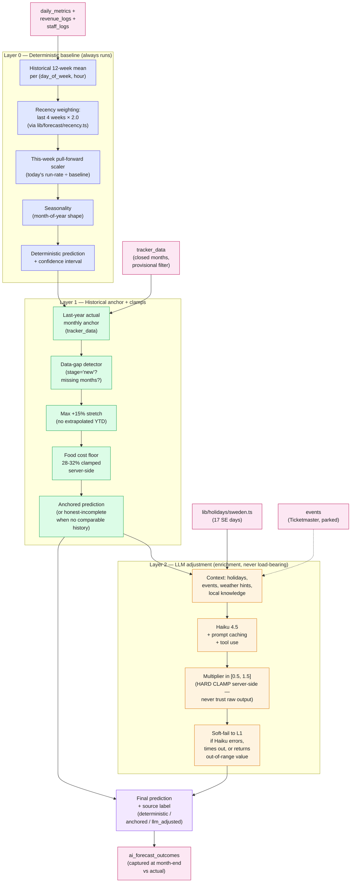
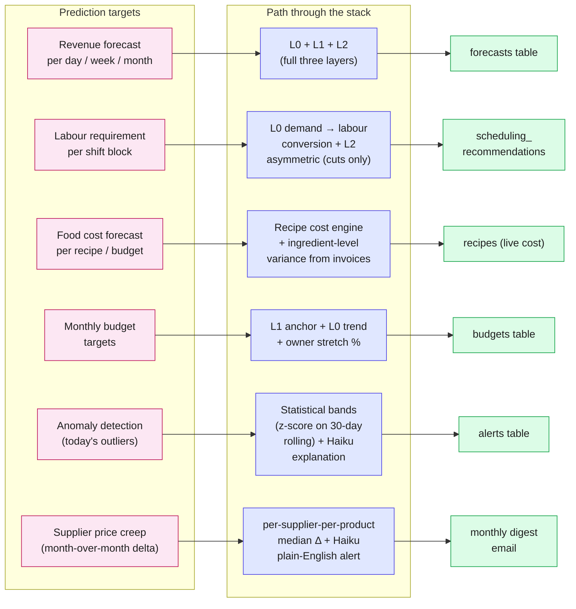
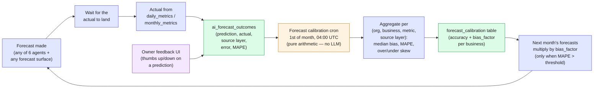
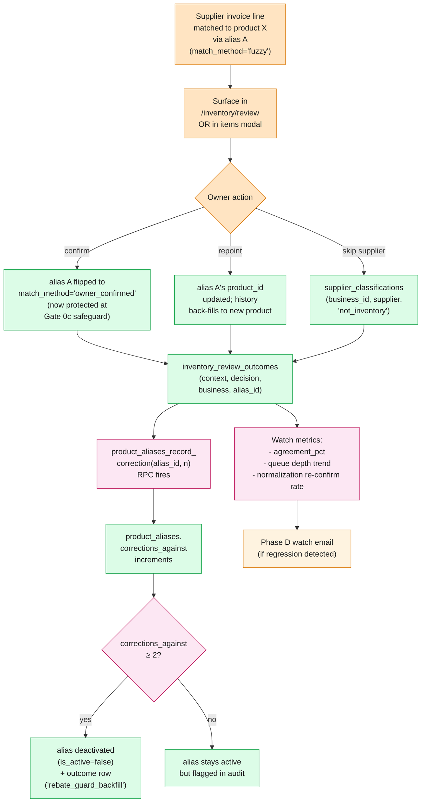
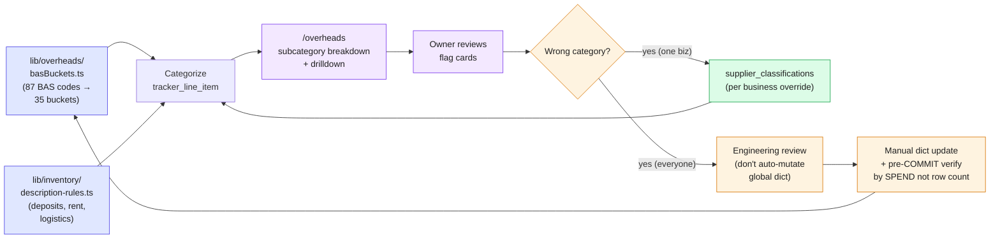
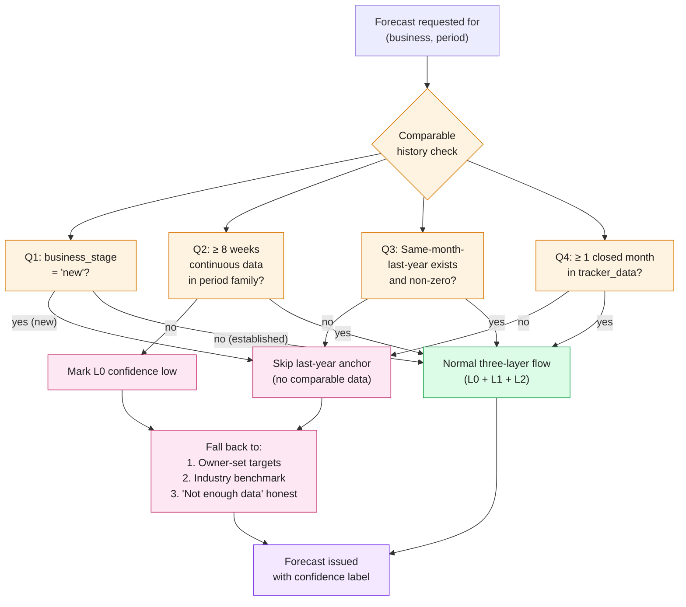

# CommandCenter — Predictive Architecture & Self-Learning

> Companion to `APP-PIPELINE-FLOWCHART.md`. That one shows the data flow;
> this one shows *how the system gets smarter over time*.
> Hand both to a design AI together.

The predictive surface has two intertwined jobs:

1. **Predict the future** — revenue tomorrow, labour next week, food cost next
   month, anomalies right now.
2. **Learn from being wrong** — capture every prediction against the actual,
   trim the bias, decay the bad signals, promote the good ones.

The architecture is deliberately **layered with safety clamps**. The fast,
deterministic layers run first; the heavier, more expressive AI layers
adjust on top with hard clamps so they can never make a confident-wrong
recommendation that would burn cash if the model misfires.

---

## 1. The three-layer prediction stack

Every numeric forecast in CommandCenter (revenue, labour, budget) goes
through the same three layers. Each layer can be the final answer; later
layers are enrichment that can soft-fail back to the previous one.

### Why three layers, not one?

A single all-LLM forecaster would be confidently wrong on cold-start, slow,
expensive, and impossible to debug. A pure-arithmetic forecaster would miss
known shocks (Ascension Thursday, Midsummer, a Eurovision night in town).

Layering gives:

- **Layer 0 always answers** — no external dependency. If Anthropic is
  down, the dashboard still loads with a number.
- **Layer 1 adds memory** — last year's June is the strongest signal for
  this June at a restaurant.
- **Layer 2 adds judgement** — Haiku reads the holiday calendar and a
  short business-state preamble (from `lib/ai/scope.ts`) to nudge the
  number ±50%. Clamped server-side so it can't go feral.

The two final surfaces (deterministic + LLM-adjusted) are graded
**side-by-side** in `ai_forecast_outcomes`. Over months we can see whether
the LLM layer is actually adding signal or just noise.

---

## 2. Where each prediction comes from

---

## 3. Self-learning — three feedback loops

The system learns through **outcome capture** at three different timescales.
Each loop has the same shape: prediction → observation → bias correction →
better prediction next time.

### 3a. The forecast calibration loop (monthly)

**Why pure arithmetic?** The calibration job runs unsupervised once a month
and its output multiplies *every* future forecast. An LLM hallucinating a
bias factor of 1.4 would silently inflate every prediction. Median bias
across a measured sample is auditable.

**Cold-start protection**: bias factor is only applied when (a) MAPE
crosses a threshold AND (b) there is comparable history. The 2026-01 Vero
"+200% over-forecast" bug came from a ratio multiplier without a
comparable-history gate; the post-mortem hardened this.

### 3b. The matcher correction loop (continuous)

Every time the owner corrects a matcher decision in `/inventory/review`,
two things happen: the visible decision flips, and a hidden quality signal
updates the alias's reputation.

**Three quality signals** the matcher watches over time:

1. **Agreement %** — share of new lines the matcher decided correctly
   (verified by owner not touching them within N days).
2. **Queue depth trend** — is `/inventory/review` getting longer or shorter?
3. **Normalization re-confirm rate** — owner confirming the same product
   under a different description variant. High rate = the normaliser is
   too strict.

When any signal moves the wrong way, an email digest fires. The matcher
itself doesn't auto-retrain on owner corrections (that would be unsafe at
restaurant scale) — instead the corrections become data for the next
manual matcher rule update.

### 3c. The category dictionary feedback loop (slow, per-tenant)

The BAS account → operator bucket dictionary (`lib/overheads/basBuckets.ts`)
is global, but every business has its own override layer at
`supplier_classifications`. When an owner says "Frimurarholmen AB is my
landlord, never food, regardless of BAS account", that overrides the
global decision for that one business.

**Key principle**: the global dictionary is updated by humans, never by
the runtime. A miscoded invoice could otherwise cause an "auto-resolve"
that silently de-globalises a category for everyone. The Fortnox AB case
in the audit log is the cautionary example — 22 SaaS lines were
miscoded to 4xxx food accounts at one customer; an auto-resolver would
have wrongly removed Fortnox AB from the global SaaS list for everyone.

---

## 4. Safety mechanisms — why this never goes feral

The predictive layer talks to live owner decisions. A wrong forecast burns
labour cash; a wrong food-cost number kills menu pricing. Five hard rules
keep the system safe:

### Rule 1 — Honest-incomplete > confident-wrong

Every cost / forecast surface MUST distinguish "I don't know" from "the
answer is zero." When the cost engine can't bridge a unit, it returns
`null` and the UI shows an "Incomplete cost" badge. When the forecast
calibrator has no comparable history, it skips the bias multiplier
instead of defaulting to 1.0 (which would mask a real cold-start).

### Rule 2 — Asymmetric scheduling

The scheduling AI can only **recommend cuts**, never adds. Reasoning:
suggesting "schedule 1 more server Saturday" creates owner liability if
demand doesn't materialise; suggesting "you could cut 2 hours from the
prep shift Wednesday" only costs money if the owner actively follows it.
The asymmetry is enforced in the prompt AND in the post-processing.

### Rule 3 — LLM is enrichment, never load-bearing

Every AI surface has a deterministic backup path that ships the same
final shape. Piece 4 LLM adjustment soft-fails to the L1 anchored
forecast. Ask CC has tool-use fallbacks. AI bulk recipe importer
falls back to "draft saved, fix manually" on parse error. The product
keeps working when Anthropic's API is down.

### Rule 4 — Clamps everywhere

- LLM forecast multiplier: `[0.5, 1.5]` server-side
- Food cost floor: 28-32%
- Budget stretch from last-year actual: max +15%
- Recipe yield: 0-10 portions per cover
- Method text: 20k chars
- Pre-order party size: 1-500
- AI daily spend: `MAX_DAILY_GLOBAL_USD=150` kill switch

Clamps are the single biggest reason a "10× forecast" or "1000 portion
per cover" never reaches production.

### Rule 5 — Trust gates on AI tool use

The Ask CC chat agent has 15 tools (revisor / vouchers / inventory /
operations). Before any cross-tenant boundary, `requireBusinessAccess()`
verifies the caller's org owns the business. Before any AI call,
`checkAndIncrementAiLimit()` enforces the daily quota atomically. Before
any matcher decision, the four-signal Gate 0 precedence runs in a
fixed order so no later rule can undo an earlier safeguard.

---

## 5. The "comparable history" gate — cold-start handling

The single most-broken assumption in restaurant prediction is "we have
enough history to forecast." A new restaurant, a new menu, a new POS
provider, a single missing month — any of these makes the L0 deterministic
output meaningless.

---

## 6. What "learning" means concretely

The system doesn't fine-tune models. It learns by **moving data into the
context** that future predictions see. Three storage rails carry the
learned state forward:

| Rail | What it stores | Used by |
|---|---|---|
| `forecast_calibration` | Bias factor + MAPE per (business, metric, source layer) | Every forecast multiplied here before display |
| `ai_forecast_outcomes` | Each prediction vs actual + source layer attribution | Calibration cron + side-by-side grading of L1 vs L2 |
| `product_aliases.corrections_against` | Demerit count per alias | Matcher Gate 0c — demoted aliases lose their veto power |
| `inventory_review_outcomes` | Every owner matcher correction | Phase D watch metrics + future matcher rule training data |
| `supplier_classifications` | Per-business "always not_inventory" overrides | Matcher Gate 0a (always wins over global) |
| `forecast_calibration.business_stage` | Onboarding state (new / 1y / 3y) | Cold-start gate skips last-year anchor |

When a new model lands (e.g. Sonnet 4.7 → 5.0), nothing migrates: the
rails are model-agnostic. The bias factor for revenue at Vero is the same
number regardless of which Claude generation produced the underlying
prediction.

---

## 7. What's not built yet (predictive roadmap)

The architecture has empty seats reserved for these:

- **Waste log → demand calibration** — actual produced-vs-sold per dish
  would re-train `recipes.portions_per_cover` from real data instead of
  owner guesses. Reservoir: `prep_sessions.completed_at` + a new
  `waste_log` table.
- **POS demand → prep auto-fill** — `pos_menu_items.recipe_id` links POS
  sales to recipes. Once owner-mapped, historical sales can predict
  covers without manual entry. Doc: `POS-RECIPE-MAPPING-PLAN.md`.
- **Booking provider integration** — SuperbExperience / OpenTable /
  ResDiary / Caspeco feed external cover counts directly into the prep
  + scheduling layers. Doc: `BOOKING-API-COVERS-PLAN.md`.
- **Live bank feeds (PSD2)** — direct cash position + cash flow feed,
  closes the gap between accounting (Fortnox) and reality. Doc:
  `LIVE-BANK-FEEDS-PLAN.md`. Trigger: ~15-25 paying customers.
- **Events → LLM forecast wiring** — Ticketmaster API + Stockholm
  geocoding → "Eurovision night, +30% expected." Doc:
  `EVENTS-LLM-INTEGRATION-PLAN.md`. ~Half-built; dormant until owner
  triggers.
- **Recipe-level waste reconciliation** — compare `waste_pct` baked
  into recipe cost vs actual waste from produced-vs-sold. Closes the
  food-cost calibration loop the same way `forecast_calibration` closes
  revenue.

All of these are reservoirs of additional context for the L2 LLM layer to
read from; none change the three-layer shape.

---

## Summary — the architecture in one paragraph

CommandCenter predicts by stacking three layers (deterministic baseline →
historical anchor → LLM adjustment), with hard clamps at every boundary
so a model failure can't cause a confident-wrong number to ship. It learns
by capturing every prediction in `ai_forecast_outcomes`, every owner
correction in `inventory_review_outcomes`, and every matcher demerit in
`product_aliases.corrections_against` — then turning those streams into
bias factors, alias demotions, and per-business overrides that ride
forward into the next prediction. The LLM is enrichment, never
load-bearing; the deterministic backup always answers. The owner sees
honest-incomplete badges instead of fabricated numbers when the data
isn't there. That's the whole game.
